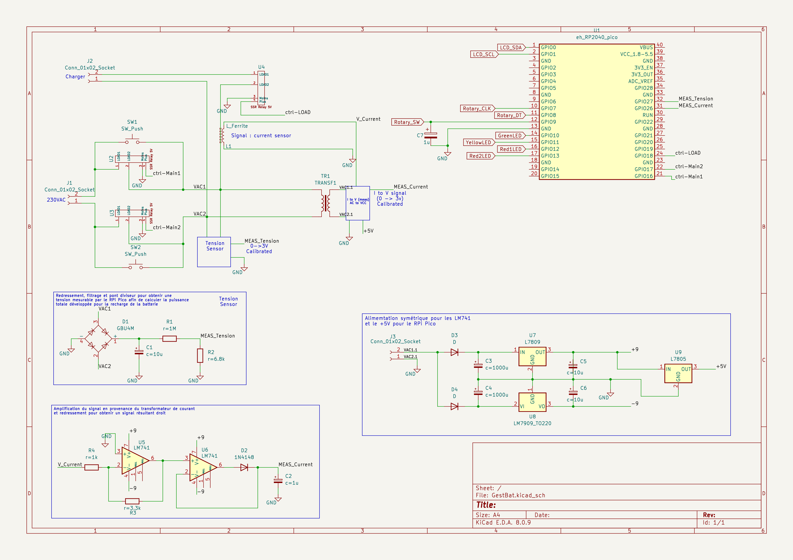

.. include:: links.rst

Documentation technique
=======================

.. note::
    Des différences peuvent apparaître entre le schémas et la réalité. Idem pour
    les N° des pins du RPI-Pico. De plus, toutes les fonctionnalités n'ont pas
    été implémentées.

Le montage général
------------------

Les fonctionalités en modules
-----------------------------

* La mise sous tension

* Le délai avant le début de la charge

* Le début de la charge

La partie électonique
---------------------

ezrfzer

