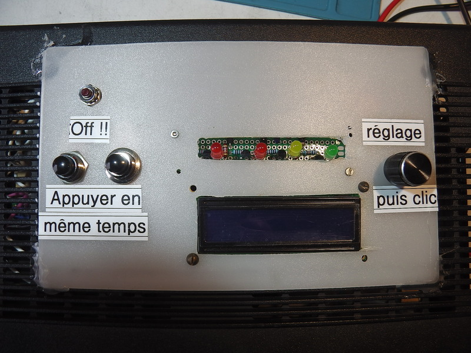

Utilisation du boîtier
======================

Les deux premières opérations à réaliser sont les branchements :

* à l'arrière : le branchement du boîtier au secteur

* à l'avant : le branchement du chargeur au boîtier

Ces deux branchements peuvent être permanents.

Les choses se passent maintenant sur la face du dessus du boîtier :

#. Mettre le boîtier sous tension en appuyant **simultanément** sur les deux boutons à gauche
   situés juste au dessus de l'étiquette "Appuyer en même temps".

#. Des LEDs clignottent, un bip se fait entendre et l'écran LCD (à 2 lignes) s'allume.

#. Par défaut, le delai avant le début de la charge est de 30mn. Il est modifiable en tournant
   la molette à droite dans un sens ou l'autre.

#. Un appui sur cette molette (comme un clic) valide le temps demandé **ET** déclenche le compte à
   rebours avant le début de la charge. La LED orange clignotte.

#. Quand le délai est expiré, des Bips se font entendre, les deux LEDs rouges clignottent
   alternativement. **C'est là que la charge de la batterie débute...**

#. Quand la charge est terminée, des Bips se font entendre, un "petit festival" d'allumage de LEDs
   se produit, quelques Bips et **Tout s'éteint !!!**

.. note::
  il est possible, à tout moment, d'annuler l'opération par un appui sur le petit bouton
  juste au dessus de l'étiquette marquée **Off !!**

  Ceci provoque l'arrêt complet de l'appareil.

.. note::
  Actuellement, lors de la charge de la batterie, les affichages se sont ni particulièrement pertinents
  ni utiles à observer. Il ne sont que des indications `subjectives` de la mesure du courant
  et du nombre des mesures.

  Cette question pourrait faire l'objet d'une amélioration ultérieure du dispositif...

